  
  
  

---

## 🧑‍💻 Sobre mim

- 💻 **Desenvolvedor Fullstack Júnior**, construindo experiências digitais completas, do banco de dados à interface, com **.NET (Entity Framework), Vue 3 e IA aplicada**.
- 🎓 Comecei em **Ciência da Computação** e segui para **Análise e Desenvolvimento de Sistemas**. Também aprendo com cursos, blogs, artigos e, principalmente, projetos pessoais.
- 🧪 Passei quase **4 anos como QA (Analista de Qualidade de Software)**, com testes manuais, automação com **Cypress**, validação de dados em SQL e bots para automatizar tarefas repetitivas. Essa base me deixou atento a qualidade, boas práticas e código limpo.
- 🛠️ No dia a dia: manutenção e refatoração de aplicações web, **Git**, **Docker**, **SonarQube** e **Scrum**.
- 🤖 Nos projetos pessoais, exploro **IA e dados**: sistemas de **RAG** (Sentence-BERT, FAISS e Gemini API), classificação de texto com **NLP** entre outras ferramentas de Machine Learning e análise de dados com **Python**.
- 📚 Sempre estudando arquitetura de software e DevOps.
- 🤝 Aberto a projetos e freelas. Se quiser conversar, o contato está no fim da página.

---

## 🚀 Tecnologias & Ferramentas

**Back-end**

  

**Front-end**

  

**Banco de dados**

  

**IA & Dados**

  

**Ferramentas & Qualidade**

  

  Também uso: Entity Framework · ASP.NET Core · SQL Server · Vuetify · Gemini API · FAISS · Hugging Face · LangGraph · SonarQube · Swagger · Jupyter

---

## 📂 Projetos em destaque

  
  

  
  

  
  

  
  

🔒 Os projetos privados ainda não têm código público. Se quiser ver algum, é só me chamar.

### 🗂️ Mais projetos

| Projeto | O que é | Stack |
|---|---|---|
| 🎮 **Cards Game** 🔒 | Jogo multiplayer em tempo real inspirado em Cards Against Humanity, já em produção na Vercel. | Next.js · Supabase Realtime · Motion |
| 🖼️ **Memory Gallery** 🔒 | Galeria de memórias que roda 100% no navegador, com as fotos guardadas no IndexedDB. | React · TypeScript · IndexedDB |
| ✨ **Sofia Lune** 🔒 | Portfólio editorial de uma modelo fictícia, com distorção 3D em WebGL e revelações no scroll. | React · GSAP · Three.js · Lenis |
| 🎭 **Kaori Vex** 🔒 | Portfólio de uma cosplayer fictícia, feito só com Vue e Vue Router, sem biblioteca de UI. | Vue 3 · TypeScript · Vite |
| 🌐 **[Portfólio](https://github.com/marcelo-ito/marcelo-ito.github.io)** | Meu site pessoal, em português e inglês, com animações. | Vue 3 · GSAP |
| 📰 **Notícias Brasil API** 🔒 | Coleta notícias brasileiras, elimina duplicatas e expõe uma API REST com busca em português. | Java 21 · Spring Boot · PostgreSQL |
| 🍽️ **Cardápio Digital** 🔒 | Cardápio online com pedidos, independente do iFood. | Nuxt 3 · Fastify · Prisma · Redis |
| 🖥️ **DevServer CLI** 🔒 | Um "VPS" em Docker para praticar nginx, SSL, bash e cron. | nginx · Bash · Docker |
| 📊 **[Arrecadação de Impostos](https://github.com/marcelo-ito/analise-arrecacao-imposto)** | Análise da arrecadação federal no Brasil de 2000 a 2024, por estado e por ano. | Python · Pandas · Seaborn |
| ⚡ **JobInsights** 🔒 | Pipeline com Spark que limpa dados de vagas e extrai skills, salários e tendências. | PySpark · Pandas · Jupyter |
| 🧠 **RAG Engine** 🔒 | Busca semântica com geração aumentada por recuperação (RAG). | Sentence-BERT · FAISS · Gemini |
| 🏷️ **NLP Pipeline** 🔒 | Classificação de texto, do TF-IDF ao fine-tuning de DistilBERT. | scikit-learn · Hugging Face |
| 🤖 **[Duolingo Discord Bot](https://github.com/marcelo-ito/DuolingoDiscordBot)** | Bot que me lembra do Duolingo e envia as últimas notícias do Correio Braziliense. | C# · .NET · NewsData API |

---

## 📊 Estatísticas do GitHub

  
  

  <picture>
    <source media="(prefers-color-scheme: dark)" srcset="https://raw.githubusercontent.com/marcelo-ito/marcelo-ito/output/snake-dark.svg" />
    
  </picture>

---

## 📬 Vamos conversar?

Aberto a conversas sobre **QA, automação de testes, desenvolvimento web e análise de dados**.

📧 [marcelo-ito@hotmail.com](mailto:marcelo-ito@hotmail.com) · 💼 [LinkedIn](https://www.linkedin.com/in/marcelo-ito-096460144/) · 🌐 [Portfólio](https://marcelo-ito.github.io)

  <i>"Aquele que tem um porquê para viver pode suportar quase qualquer como."</i> 
  <i>"Desistir é uma solução permanente para um problema temporário."</i>

